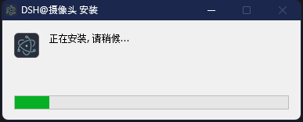
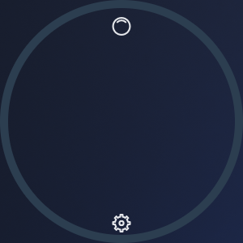
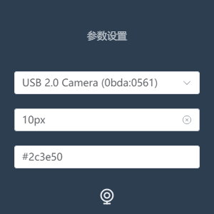

基于 Electron+Vue3+Vite 开发的桌面摄像头软件，方便直播录课、短视频拍摄等场景。

# 功能特点

-   支持摄像头切换
-   摄像头窗口置顶
-   配置边框宽度
-   定义边框颜色
-   支持圆角与横屏显示
-   Window、Mac 多系统支持
-   支持窗口全屏
-   可以开启多个摄像头
-   摄像头镜像操作

## 效果展示

-   摄像头角效果
    
-   支持横屏样式
    
-   支持多种参数的配置
-   支持多摄像头选择
    
